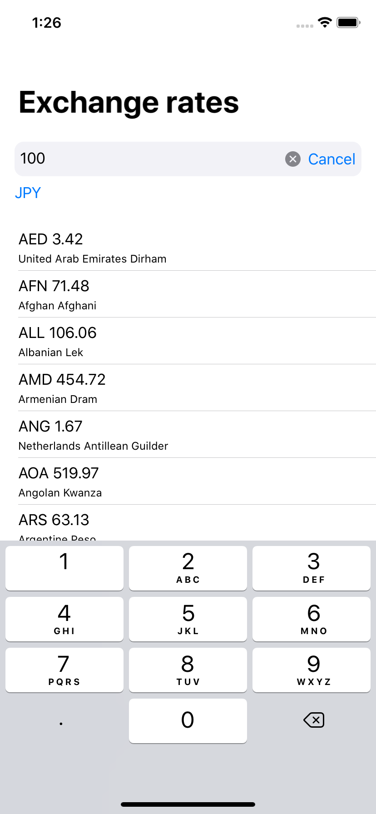

# Currency

Exchange rate view viewer. Playground for testing SwiftUI,  Redux & Combine.
 


## How to use

Get an API Key from [currencylayer.com](https://currencylayer.com) and paste it in the file SceneDelegate.swift and start the app.

```
   
    // Use either the standard shared object that communicates
    // Remotely with every registered service.

     let apiKey = "YOUR_KEY"
     shared = defaultShared(withKey: apiKey)

     // OR

     // Use the testing evironment.
     // Responses are in the directory 'Mocking'

     // shared = testShared()
    
```

## Features
- Request list of currencies
- CurrencyPicker
- Calculate exchange amount
- Request live quotes
- Local mocking
- Persist AppState -> middleware
- Logger middleware
  
## Info
- Created with XCode 11.4.1 
- Swift 5.2
- Requires iOS 13.4
- Available for iPhone & iPad
- swiftlint version 0.39.2
